#多线程 
# 线程池源码
## 1 线程池成员变量定义
### 1.1 线程池状态
![[002tech_notes/01Java/JUC 源码/线程池状态流转.svg]]
`java.util.concurrent.ThreadPoolExecutor` 中定义以上了5个常量表示线程池状态。 Java中int以补码形式存储，5种状态表示的真值关系为：
RUNNING < SHUTDOWN < STOP < TIDYING < TERMINATED。具体定义和使用可以在[[002tech_notes/01Java/JUC 源码/线程池源码#3 CTL 定义与使用 | CTL 定义与使用]]中可以看到。
### 1.2 线程池继承架构

```mermaid
classDiagram
direction BT
class AbstractExecutorService {
  + submit(Runnable, T) Future~T~
  + submit(Callable~T~) Future~T~
  # newTaskFor(Callable~T~) RunnableFuture~T~
  + invokeAll(Collection~Callable~T~~) List~Future~T~~
  + invokeAny(Collection~Callable~T~~, long, TimeUnit) T
  - doInvokeAny(Collection~Callable~T~~, boolean, long) T
  - cancelAll(ArrayList~Future~T~~, int) void
  + submit(Runnable) Future~?~
  - cancelAll(ArrayList~Future~T~~) void
  + invokeAny(Collection~Callable~T~~) T
  # newTaskFor(Runnable, T) RunnableFuture~T~
  + invokeAll(Collection~Callable~T~~, long, TimeUnit) List~Future~T~~
}
class Executor {
<<Interface>>
  + execute(Runnable) void
}
class ExecutorService {
<<Interface>>
  + submit(Runnable, T) Future~T~
  + invokeAll(Collection~Callable~T~~, long, TimeUnit) List~Future~T~~
  + isShutdown() boolean
  + awaitTermination(long, TimeUnit) boolean
  + invokeAny(Collection~Callable~T~~) T
  + invokeAll(Collection~Callable~T~~) List~Future~T~~
  + submit(Runnable) Future~?~
  + isTerminated() boolean
  + shutdown() void
  + shutdownNow() List~Runnable~
  + submit(Callable~T~) Future~T~
  + invokeAny(Collection~Callable~T~~, long, TimeUnit) T
}
class ThreadPoolExecutor {
  ~ tryTerminate() void
  ~ ensurePrestart() void
  + setMaximumPoolSize(int) void
  - interruptIdleWorkers(boolean) void
  - runStateLessThan(int, int) boolean
  + allowCoreThreadTimeOut(boolean) void
  + shutdownNow() List~Runnable~
  + setKeepAliveTime(long, TimeUnit) void
  - drainQueue() List~Runnable~
  ~ isStopped() boolean
  + getRejectedExecutionHandler() RejectedExecutionHandler
  + isTerminated() boolean
  + getLargestPoolSize() int
  + getCorePoolSize() int
  + allowsCoreThreadTimeOut() boolean
  ~ runWorker(Worker) void
  - interruptIdleWorkers() void
  - processWorkerExit(Worker, boolean) void
  # terminated() void
  - compareAndIncrementWorkerCount(int) boolean
  + remove(Runnable) boolean
  - runStateAtLeast(int, int) boolean
  + getThreadFactory() ThreadFactory
  - checkShutdownAccess() void
  - compareAndDecrementWorkerCount(int) boolean
  + isShutdown() boolean
  - decrementWorkerCount() void
  - ctlOf(int, int) int
  - interruptWorkers() void
  + prestartCoreThread() boolean
  + getKeepAliveTime(TimeUnit) long
  # beforeExecute(Thread, Runnable) void
  + awaitTermination(long, TimeUnit) boolean
  + getCompletedTaskCount() long
  + getActiveCount() int
  # afterExecute(Runnable, Throwable) void
  ~ onShutdown() void
  - addWorkerFailed(Worker) void
  + getTaskCount() long
  + toString() String
  + getPoolSize() int
  + prestartAllCoreThreads() int
  + execute(Runnable) void
  - addWorker(Runnable, boolean) boolean
  + getMaximumPoolSize() int
  - isRunning(int) boolean
  + setThreadFactory(ThreadFactory) void
  + setRejectedExecutionHandler(RejectedExecutionHandler) void
  - getTask() Runnable
  + isTerminating() boolean
  + getQueue() BlockingQueue~Runnable~
  - runStateOf(int) int
  + purge() void
  - workerCountOf(int) int
  ~ reject(Runnable) void
  # finalize() void
  + setCorePoolSize(int) void
  - advanceRunState(int) void
  + shutdown() void
}

AbstractExecutorService  ..>  ExecutorService 
ExecutorService  -->  Executor 
ThreadPoolExecutor  -->  AbstractExecutorService 

```

### 1.3 CTL 定义与使用
```java
// 高三位表示线程运行状态，剩下的低位表示线程数量
private final AtomicInteger ctl = new AtomicInteger(ctlOf(RUNNING, 0));  
// Integer.SIZE 是  int 所占用的位数。在java8 中为32
private static final int COUNT_BITS = Integer.SIZE - 3;  
// java8 中叫 capacity，表示最大的线程数量 000 1111111... 
private static final int COUNT_MASK = (1 << COUNT_BITS) - 1;  

// runState is stored in the high-order bits  
private static final int RUNNING    = -1 << COUNT_BITS;  // 111 0000000000000000000000000000
private static final int SHUTDOWN   =  0 << COUNT_BITS;  // 000 0000000000000000000000000000
private static final int STOP       =  1 << COUNT_BITS;  // 001 0000000000000000000000000000
private static final int TIDYING    =  2 << COUNT_BITS;  // 010 0000000000000000000000000000
private static final int TERMINATED =  3 << COUNT_BITS;  // 011 0000000000000000000000000000


// Packing and unpacking ctl  
private static int runStateOf(int c)     { return c & ~COUNT_MASK; }  
private static int workerCountOf(int c)  { return c & COUNT_MASK; }  // 通过或运算
private static int ctlOf(int rs, int wc) { return rs | wc; }    // 一般用于重置 ctl 的值。rs：线程状态  wc：worker 数量 

// 判断大小 RUNNING < SHUTDOWN < STOP < TIDYING < TERMINATED
private static boolean runStateLessThan(int c, int s) {  
    return c < s;  
}  
  
private static boolean runStateAtLeast(int c, int s) {  
    return c >= s;  
}  
  
private static boolean isRunning(int c) {  
    return c < SHUTDOWN;  
}
```

### 1.4 内部类 Worker 定义
![[attachments/Pasted image 20220914211701.png | 400]]
```java
private final class Worker  
    extends AbstractQueuedSynchronizer  
    implements Runnable  
{  
    /**  
     * This class will never be serialized, but we provide a     * serialVersionUID to suppress a javac warning.     */ 
	 private static final long serialVersionUID = 6138294804551838833L;  
  
    /** Thread this worker is running in.  Null if factory fails. */  
    final Thread thread;  
    /** Initial task to run.  Possibly null. */  
    Runnable firstTask;  
    /** Per-thread task counter */  
    volatile long completedTasks;

    // firstTask 可以为null，为null 的话启动后回到queue中获取
    Worker(Runnable firstTask) {  
        // AQS 设置为独占模式
        setState(-1); // inhibit interrupts until runWorker  
        // 使用线程工厂创建一个线程，并将当前worker指定为 Runnable。也就是说当thread启动时，会以worker.run()为入口
        this.firstTask = firstTask;  
        this.thread = getThreadFactory().newThread(this);  
    }  
    
    /** Delegates main run loop to outer runWorker. */  
    public void run() {  
        // 核心方法
        runWorker(this);  
    }
    /*
     .......
    */
}
```
`Worker` 是 `ThreadPoolExecutor` 中的一个内部类。采用了AQS 的独占模式 #unknown 。实现了`Runnable`接口，run 方法调用了 `hreadPoolExecutor.runWorker()`。这个是核心方法后面分析 worker 启动逻辑会从此切入。
- `thread`: 是 worker 内部封装的工作线程。
- `firstTask`:  如果不为空，那么当 worker 启动后，会优先执行 firstTask，当执行完 firstTask 之后，会到 queue 中去获取下一个任务。

## 2 execute()
```java
public void execute(c command) {  
    
    if (command == null)  
        throw new NullPointerException();  
    int c = ctl.get();  
    // 线程数小于核心线程数，直接创建一个新线程执行任务
    if (workerCountOf(c) < corePoolSize) {  
        if (addWorker(command, true))  
            return;  // 创建线程成功，则返回
        c = ctl.get();  
    }  
    
    // 
    if (isRunning(c) && workQueue.offer(command)) {  
        int recheck = ctl.get();  
        // 提交之后线程池状态被其他线程更改，则把刚刚添加的任务移除
        if (! isRunning(recheck) && remove(command))  
            // 移除成功，走拒绝策略
            reject(command);  
        else if (workerCountOf(recheck) == 0)  
            // 是 running 状态，或者移除任务失败。要保证线程池中至少有一个线程
            addWorker(null, false);  
    }  
    else if (!addWorker(command, false))  
        reject(command);  
}
```

![[002tech_notes/01Java/JUC 源码/线程池execute方法流程.svg]]
## 3 addWorker()
`addWorker()`如果返回 true，则代表线程已经创建好放入了线程池中，并且已经调用了`start()`方法开启了线程。
worker 中的线程启动后，会调用重写的 `run()` 方法，[[002tech_notes/01Java/JUC 源码/线程池源码#1.4 内部类 Worker 定义|Worker定义]]中可以发现。run 调用了 `ThreadPoolExecutor#runWorker`。 
```java
//firstTask 可以为null，表示启动worker之后，worker自动到queue中获取任务.. 如果不是null，则worker优先执行firstTask  
//core 采用的线程数限制 如果为true 采用 核心线程数限制  false采用 maximumPoolSize线程数限制.  
  
//返回值总结：  
//true 表示创建worker成功，且线程启动  
  
//false 表示创建失败。  
//1.线程池状态rs > SHUTDOWN (STOP/TIDYING/TERMINATION)  
//2.rs == SHUTDOWN 但是队列中已经没有任务了 或者 当前状态是SHUTDOWN且队列未空，但是firstTask不为null  
//3.当前线程池已经达到指定指标（coprePoolSize 或者 maximumPoolSIze）  
//4.threadFactory 创建的线程是null  
private boolean addWorker(Runnable firstTask, boolean core) {  
    //自旋 判断当前线程池状态是否允许创建线程的事情。  
    retry:  
    for (;;) {  
        //获取当前ctl值保存到c  
        int c = ctl.get();  
        //获取当前线程池运行状态 保存到rs长  
        int rs = runStateOf(c);  
        
        // Check if queue empty only if necessary.  
        
        //条件一：rs >= SHUTDOWN 成立：说明当前线程池状态不是running状态  
        //条件二：前置条件，当前的线程池状态不是running状态  ! (rs == SHUTDOWN && firstTask == null && ! workQueue.isEmpty())
        //rs == SHUTDOWN && firstTask == null && ! workQueue.isEmpty()
        //表示：当前线程池状态是SHUTDOWN状态 & 提交的任务是空，addWorker这个方法可能不是execute调用的。 & 当前任务队列不是空  
        //排除掉这种情况，当前线程池是SHUTDOWN状态，但是队列里面还有任务尚未处理完，这个时候是允许添加worker，但是不允许再次提交task。  
        if (rs >= SHUTDOWN &&  
                ! (rs == SHUTDOWN &&  
                        firstTask == null &&  
                        ! workQueue.isEmpty()))  
            //什么情况下回返回false?  
            //线程池状态 rs > SHUTDOWN            //rs == SHUTDOWN 但是队列中已经没有任务了 或者 rs == SHUTDOWN 且 firstTask != null            return false;  
  
        //上面这些代码，就是判断 当前线程池状态 是否允许添加线程。  
  
  
        //内部自旋 获取创建线程令牌的过程。  
        for (;;) {  
            //获取当前线程池中线程数量 保存到wc中  
            int wc = workerCountOf(c);  
  
            //条件一：wc >= CAPACITY 永远不成立，因为CAPACITY是一个5亿多大的数字  
            //条件二：wc >= (core ? corePoolSize : maximumPoolSize)  
            //core == true ,判断当前线程数量是否>=corePoolSize，会拿核心线程数量做限制。  
            //core == false,判断当前线程数量是否>=maximumPoolSize，会拿最大线程数量做限制。  
            if (wc >= CAPACITY ||  
                    wc >= (core ? corePoolSize : maximumPoolSize))  
                //执行到这里，说明当前无法添加线程了，已经达到指定限制了  
                return false;  
  
            //条件成立：说明记录线程数量已经加1成功，相当于申请到了一块令牌。  
            //条件失败：说明可能有其它线程，修改过ctl这个值了。  
            //可能发生过什么事？  
            //1.其它线程execute() 申请过令牌了，在这之前。导致CAS失败  
            //2.外部线程可能调用过 shutdown() 或者 shutdownNow() 导致线程池状态发生变化了，咱们知道 ctl 高3位表示状态  
            //状态改变后，cas也会失败。  
            if (compareAndIncrementWorkerCount(c))  
                //进入到这里面，一定是cas成功啦！申请到令牌了  
                //直接跳出了 retry 外部这个for自旋。  
                break retry;  
  
            //CAS失败，没有成功的申请到令牌  
            //获取最新的ctl值  
            c = ctl.get();  // Re-read ctl  
            //判断当前线程池状态是否发生过变化,如果外部在这之前调用过shutdown. shutdownNow 会导致状态变化。  
            if (runStateOf(c) != rs)  
                //状态发生变化后，直接返回到外层循环，外层循环负责判断当前线程池状态，是否允许创建线程。  
                continue retry;  
            // else CAS failed due to workerCount change; retry inner loop  
        }  
    }  
    
    //表示创建的worker是否已经启动，false未启动  true启动  
    boolean workerStarted = false;  
    //表示创建的worker是否添加到池子中了 默认false 未添加 true是添加。  
    boolean workerAdded = false;  
  
    //w表示后面创建worker的一个引用。  
    Worker w = null;  
    try {  
        //创建Worker，执行完后，线程应该是已经创建好了。  
        w = new Worker(firstTask);  
  
        //将新创建的worker节点的线程 赋值给 t        final Thread t = w.thread;  
  
        //为什么要做 t != null 这个判断？  
        //为了防止ThreadFactory 实现类有bug，因为ThreadFactory 是一个接口，谁都可以实现。  
        //万一哪个 小哥哥 脑子一热，有bug，创建出来的线程 是null、、  
        //Doug lea考虑的比较全面。肯定会防止他自己的程序报空指针，所以这里一定要做！  
        if (t != null) {  
            //将全局锁的引用保存到mainLock  
            final ReentrantLock mainLock = this.mainLock;  
            //持有全局锁，可能会阻塞，直到获取成功为止，同一时刻 操纵 线程池内部相关的操作，都必须持锁。  
            mainLock.lock();  
            //从这里加锁之后，其它线程 是无法修改当前线程池状态的。  
            try {  
                // Recheck while holding lock.  
                // Back out on ThreadFactory failure or if                // shut down before lock acquired.                //获取最新线程池运行状态保存到rs中  
                int rs = runStateOf(ctl.get());  
  
                //条件一：rs < SHUTDOWN 成立：最正常状态，当前线程池为RUNNING状态.  
                //条件二：前置条件：当前线程池状态不是RUNNING状态。  
                //(rs == SHUTDOWN && firstTask == null)  当前状态为SHUTDOWN状态且firstTask为空。其实判断的就是SHUTDOWN状态下的特殊情况，  
                //只不过这里不再判断队列是否为空了  
                if (rs < SHUTDOWN ||  
                        (rs == SHUTDOWN && firstTask == null)) {  
                    //t.isAlive() 当线程start后，线程isAlive会返回true。  
                    //防止脑子发热的程序员，ThreadFactory创建线程返回给外部之前，将线程start了。。  
                    if (t.isAlive()) // precheck that t is startable  
                        throw new IllegalThreadStateException();  
  
                    //将咱们创建的worker添加到线程池中。  
                    workers.add(w);  
                    //获取最新当前线程池线程数量  
                    int s = workers.size();  
                    //条件成立：说明当前线程数量是一个新高。更新largestPoolSize  
                    if (s > largestPoolSize)  
                        largestPoolSize = s;  
                    //表示线程已经追加进线程池中了。  
                    workerAdded = true;  
                }  
            } finally {  
                //释放线程池全局锁。  
                mainLock.unlock();  
            }  
            //条件成立:说明 添加worker成功  
            //条件失败：说明线程池在lock之前，线程池状态发生了变化，导致添加失败。  
            if (workerAdded) {  
                //成功后，则将创建的worker启动，线程启动。  
                t.start();  
                //启动标记设置为true  
                workerStarted = true;  
            }  
        }  
  
    } finally {  
        //条件成立：! workerStarted 说明启动失败，需要做清理工作。  
        if (! workerStarted)  
            //失败时做什么清理工作？  
            //1.释放令牌  
            //2.将当前worker清理出workers集合  
            addWorkerFailed(w);  
    }  
  
    //返回新创建的线程是否启动。  
    return workerStarted;  
}
```

## 4 runWorker()
Worker 中的线程启动后调用这个方法。循环从工作队列中获取任务去执行。
```java
//w 就是启动worker  
final void runWorker(Worker w) {  
    //wt == w.thread  
    Thread wt = Thread.currentThread();  
    //将初始执行task赋值给task  
    Runnable task = w.firstTask;  
    //清空当前w.firstTask引用  
    w.firstTask = null;  
    //这里为什么先调用unlock? 就是为了初始化worker state == 0 和 exclusiveOwnerThread ==null    w.unlock(); // allow interrupts  
  
    //是否是突然退出，true->发生异常了，当前线程是突然退出，回头需要做一些处理  
    //false->正常退出。  
    boolean completedAbruptly = true;  
  
    try {  
        //条件一：task != null 指的就是firstTask是不是null，如果不是null，直接执行循环体里面。  
        //条件二：(task = getTask()) != null   条件成立：说明当前线程在queue中获取任务成功，getTask这个方法是一个会阻塞线程的方法  
        //getTask如果返回null，当前线程需要执行结束逻辑。  
        while (task != null || (task = getTask()) != null) {  
            //worker设置独占锁 为当前线程  
            //为什么要设置独占锁呢？shutdown时会判断当前worker状态，根据独占锁是否空闲来判断当前worker是否正在工作。  
            w.lock();  
            // If pool is stopping, ensure thread is interrupted;  
            // if not, ensure thread is not interrupted.  This
            // requires a recheck in second case to deal with
            // shutdownNow race while clearing interrupt  
            //条件一：runStateAtLeast(ctl.get(), STOP)  说明线程池目前处于STOP/TIDYING/TERMINATION 此时线程一定要给它一个中断信号  
            //条件一成立：runStateAtLeast(ctl.get(), STOP)&& !wt.isInterrupted()  
            //上面如果成立：说明当前线程池状态是>=STOP 且 当前线程是未设置中断状态的，此时需要进入到if里面，给当前线程一个中断。  
  
            //假设：runStateAtLeast(ctl.get(), STOP) == false  
            // (Thread.interrupted() && runStateAtLeast(ctl.get(), STOP)) 在干吗呢？  
            // Thread.interrupted() 获取当前中断状态，且设置中断位为false。连续调用两次，这个interrupted()方法 第二次一定是返回false.  
            // runStateAtLeast(ctl.get(), STOP) 大概率这里还是false.  
            // 其实它在强制刷新当前线程的中断标记位 false，因为有可能上一次执行task时，业务代码里面将当前线程的中断标记位 设置为了 true，且没有处理  
            // 这里一定要强制刷新一下。不会再影响到后面的task了。  
            //假设：Thread.interrupted() == true  且 runStateAtLeast(ctl.get(), STOP)) == true 
            //这种情况有发生几率么？  
            //有可能，因为外部线程在 第一次 (runStateAtLeast(ctl.get(), STOP) == false 后，有机会调用shutdown 、shutdownNow方法，将线程池状态修改  
            //这个时候，也会将当前线程的中断标记位 再次设置回 中断状态。  
            if ((runStateAtLeast(ctl.get(), STOP) ||  
                    (Thread.interrupted() &&  
                            runStateAtLeast(ctl.get(), STOP))) &&  
                    !wt.isInterrupted())  
                wt.interrupt();  
            try {  
                //钩子方法，留给子类实现的  
                beforeExecute(wt, task);  
                //表示异常情况，如果thrown不为空，表示 task运行过程中 向上层抛出异常了。  
                Throwable thrown = null;  
                try {  
                    //task 可能是FutureTask 也可能是 普通的Runnable接口实现类。  
                    //如果前面是通过submit()提交的 runnable/callable 会被封装成 FutureTask。这个不清楚，请看上一期，在b站。  
                    task.run();  
                } catch (RuntimeException x) {  
                    thrown = x; throw x;  
                } catch (Error x) {  
                    thrown = x; throw x;  
                } catch (Throwable x) {  
                    thrown = x; throw new Error(x);  
                } finally {  
                    //钩子方法，留给子类实现的  
                    afterExecute(task, thrown);  
                }  
            } finally {  
                //将局部变量task置为Null  
                task = null;  
                //更新worker完成任务数量  
                w.completedTasks++;  
  
                //worker处理完一个任务后，会释放掉独占锁  
                //1.正常情况下，会再次回到getTask()那里获取任务  while(getTask...)                //2.task.run()时内部抛出异常了..  
                w.unlock();  
            }  
        }  
        //什么情况下，会来到这里？  
        //getTask()方法返回null时，说明当前线程应该执行退出逻辑了。  
        completedAbruptly = false;  
    } finally {  
        //task.run()内部抛出异常时，直接从 w.unlock() 那里 跳到这一行。  
        //正常退出 completedAbruptly == false        
        //异常退出 completedAbruptly == true        
        processWorkerExit(w, completedAbruptly);  
    }  
}
```

## 5 getTask()
调用此方法来从队列中获取任务。如果获取的到则返回该任务，如果获取不到则会将当前线程阻塞住 。如果阻塞则根据参数判断是否支持超时机制 #todo (可能表述有误，不是阻塞)。如果该方法返回了 null 则会出发线程相关逻辑

