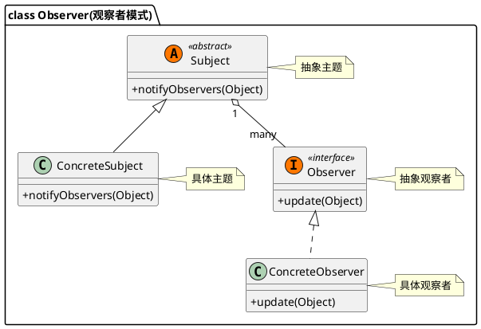

## 1 uml

## 2 什么是观察者模式
观察者模式（Observer Pattern）：在对象之间定义一个一对多的依赖，当一个对象状态改变的时候，所有依赖的对象都会得到通知并自动更新。说人话：也叫**发布订阅模式**，能够很好的解耦一个对象改变，自动改变另一个对象这种情况。

## 3 应用场景
### 3.1 JDK  中已经定义了观察者模式的基本结构
`public class Observable`为上面uml 中的 Subject。即被观察者。
`public interface Observer`为 uml 中的 Observer。为观察者

### 3.2 Spring 事件发布与监听

### 3.3 RxJava 使用扩展的观察者模式
![[attachments/20230129153810.png]]
![[attachments/20210321110153668.png]]

## 4 观察者模式优缺点
### 4.1 优点
1. 建立一套触发机制。
2. Subject和Observer之间是松偶合的，分别可以各自独立改变。 
3. Subject在发送广播通知的时候，无须指定具体的Observer，Observer可以自己决定是否要订阅Subject的通知。 
4. 遵守大部分GRASP原则和常用设计原则，高内聚、低偶合。观察者和被观察者是抽象耦合的。

### 4.2 缺点
1. 如果一个被观察者对象有很多的直接和间接的观察者的话，将所有的观察者都通知到会花费很多时间。
2. 如果在观察者和观察目标之间有**循环依赖**的话，观察目标会触发它们之间进行循环调用，可能导致系统崩溃。（最有可能引发事故的一点）
3. 观察者模式没有相应的机制让观察者知道所观察的目标对象是怎么发生变化的，而仅仅只是知道观察目标发生了变化。
