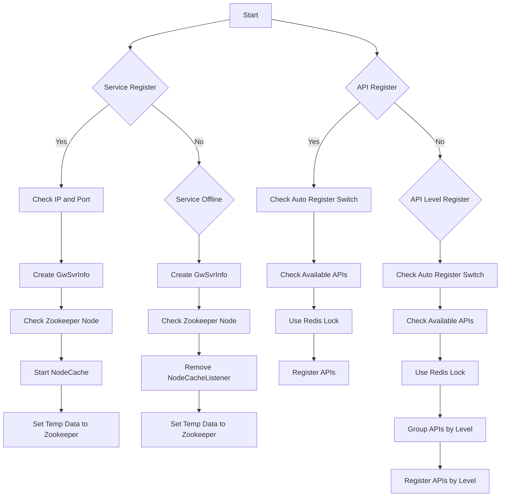

## 个人信息
- 姓名：
- 联系方式：
  - 电话：
  - 邮箱：
  - 地址：

## 教育背景
### 武汉纺织大学（一本）计算机科学与技术，2017年毕业。
大学期间 GPA 前 5%，利用业余时间自学了人工智能相关技术，并在相关比赛中获奖。

## 专业技能
1. 熟悉 Java编程语言，掌握集合框架、I/O流、异常、反射等机制；阅读过 ArrayList、HashMap 源码，了解其扩容机制；
2. 熟悉 Java 并发容器和锁，如 ConcurrentHashMap、CAS、AQS等；
3. 熟悉 Java 内存结构，JVM参数调优，Tomcat调优；
4. 熟练使用 SpringBoot 、SpringMVC、Mybatis 等框架，能够运用并独立开发项目，熟悉AOP、IOC等原理；
5. 熟悉 MySQL 使用和原理，熟悉索引、事务、日志、锁等机制，能够对常见 SQL 语句调优， 了解读写分离、分库分表；
6. 熟悉 Redis 使用和原理，线程模型、持久化机等机制，熟悉高可用方案，熟悉缓存雪崩、穿透、击穿解决方案；
7. 熟悉即时通讯 WebSocket 技术，应用过 Netty 等框架技术；
8. 熟悉 Maven，Git 代码管理，有多分支并行开发经验；
9. 熟悉 Nginx，Docker 及其相关组件和容器化技术，能够做快速的业务应用开发和 Devops 相关工作。

## 工作经历
### 东方财富，Java工程师，2021.7-2024.8
- 根据需求文档进行分析设计，并完成接口文档的编写工作。
- 根据接口文档在开发环境完成代码的编写工作，并进行单元测试，无问题后将代码上传至测试环境。
- 配合测试部门在测试环境进行测试工作，交付提测文件，并进行bug修复工作。

## 项目经验
### 海外自研柜台清算系统
#### 项目描述
清算日间发生的交易，包括股票、债券、期货、期权等，保证资券正确交收。并对日间交易产生的数据进行归档。

#### 职责和贡献
- 把基于 Oracle 的项目进行重构，转换为使用 SSM 并搭配 MySQL 数据库的架构，并协助完成百万用户数据迁移。
- 通过分析 JVM 内存快照，解决了从 Oracle 切换 MySql 后内存占用过高的问题。将内存占用量减少到原来的 1/3。
- 引入 `testcontainers` 进行集成测试，提高了测试效率，减少了对外部环境的依赖。同时让测试用例更便于管理，推动 `TDD` 的实践。
- 使用`责任链模式`重构清算系统的订单匹配逻辑，使得系统更加灵活，易于扩展。
- 使用`工厂模式` + 数据库配置的模式，实现了清算流程的动态配置，使得清算流程更加灵活。
- 根据实际业务特性，使用了吞吐量更高的 GC 。

#### 问题
异构难点值得讲的比如前后逻辑兼容性、数据涉及迁移的话怎么保证一致性、怎么切流

##### Q：怎么保证新系统（Java）的逻辑和原来的系统（Oracle）一致？

A：原来的系统对每天的清算结果都有归档，我们写了一个程序。通过模拟历史的清算数据，对比新系统和原系统的清算结果，保证了新系统的正确性。

对于读的操作，我们会把这个请求同时发给新系统和原系统，对比结果，并输出日志。

##### Q：批处理系统难以测试
- 对脏数据敏感
- 校验的表多
- 直接在开发线上测试，影响其他业务的测试（卡住了的话）。
- 没有先前积累的测试用例，编写用例麻烦。

采用 docker 启动一个新数据库的方式进行测试。解决了脏数据的问题。只用维护一个 sql 脚本。
直接将当时线上版本的跑出来的数据

##### Q：清算会修改资券，如果同时业务也操作了资券，会不会出现问题？

A：会有问题。解决方式：
1. 业务上，清算和业务操作资券的时间不重叠。
2. 技术上。使用乐观锁，保证数据的一致性。ABA 问题不敏感。

##### Q：清算系统的数据量很大，如何保证清算的性能？

A：多线程、CompletableFuture、索引优化、GC优化。

### 配置中心
#### 项目描述
自研配置中心，支持配置的动态更新，支持配置的版本管理，支持配置的回滚。
在 redis、zk、数据库相关配置发生变化时，能够及时通知到相关的业务系统，并实现数据源的热更新。

#### 职责和贡献

### 自研网关、RPC
#### 项目描述
使用 Netty 实现网关，同时支持 HTTP、TCP 协议，支持负载均衡、限流、熔断等功能。各业务系统启动后自动注册到网关，可以通过网关统一访问。

#### 职责和贡献
- 客服务启动时将接口注册到 zookeeper，网关通过 zookeeper 发现服务，实现了服务的自动发现。
- 客户端处理请求时，引入高低优先级队列对不同级别的请求进行处理，保证了高优先级请求的及时响应。TPS 提高了 50%。
- 记录各请求的处理时间，通过接口的平均处理时间，自动调整接口的优先级。

#### 问题
Q：为什么不用 Nacos + Dubbo 等开源方案？

A：
1. 原先的老系统无法接入 Nacos 等新的开源方案。它只提供了 HTTP、TCP 的接口。老系统只有一个接口，通过入参的 functionId 来区分不同的业务。中台的逻辑也是基于此开发的，它们希望只用修改一个服务器 ip，就能兼容新旧系统切换。
2. Dubbo 虽然支持 HTTP 或者 自定义的协议，但中台代码还是需要改动。Dubbo http 调用，是用 post 请求 `http://ip:port/serviceClassName` { method: methodName, parameterTypes: [], arguments: [] } 这样的请求体，不符合老系统的接口规范。
3. 自研网关在业务上有更多的定制化需求。比如，数据迁移期间判断一个用户是否自研用户，不是自研的用户就返回错误码。
4. Dubbo 堆砌了很多功能，但我们实际上只需要其中的一部分功能。自研网关只实现了我们需要的功能，降低了复杂度。

Q：网关在安全方面有哪些措施呢？比如身份验证、授权等。

Q：如何保证网关的高可用？

A：

Q：负载均衡、限流、熔断、降级(服务治理)等功能如何实现？

A：熔断是

Q：自动调整优先级的具体策略是什么？

A：

Q：ZK 里面的节点是如何设计的？

Q：

### Sqlbridge 数据中间件
#### 项目描述
sqlbridge 是一个自研数据中间件，包括 support-sqlbridge 依赖和 Sqlbridge 服务两个部分。项目中引入 support-sqlbridge 后，可以将原本直接查询 MySQL 的 SQL 请求转发到 Sqlbridge 服务端，由 Sqlbridge 服务端执行查询后返回给客户端。在对外围提供了查询的功能同时，保证了柜台数据的安全，同时提供 sql 审计功能。

#### 职责和贡献
- 业务方服务启动时，解析各种方式配置的 SQL。
- 通过 AOP 拦截 SQL 请求，将 SQL 请求转发到 Sqlbridge 服务。
- 自定义实现了读写分离

1. explain 该语句的执行计划
2. 替换查询参数，拼接 排序条件
3. 分页请求是否要总数
4. 替换枚举值

#### 问题
Q：如何实现读写分离的？

A：自定义注解标识 sql 走读库还是写库，然后存入 threadlocal ，执行 sql 前切换数据源。

Q：thread local 相关八股。

Q：MyBatis 如何解析 SQL？

Q：MyBatis 缓存对 Sqlbridge 有什么影响？

Q：AOP 拦截 SQL 请求的具体实现？

A：自定义 @SQLBridge 注解，通过 @Around 拦截带有 @SQLBridge 注解的方法，将 SQL 请求转发到 Sqlbridge 服务端。

Q：Sql审计功能是怎么实现的？

A：sqlbridge 服务端接收到 sql 请求后，将 sql 语句和耗时记录到数据库中。 

// 定时查询 select * from sys.statements_with_full_table_scans; statments_with_sorting 等数据，将有问题的 sql 语句汇报给开发人员。

## 职业求职意向

# 范文例句

熟悉 Java 内存结构，JVM参数调优，Tomcat调优；
熟练使用 SpringBoot 、SpringMVC、Mybatis 等框架，能够运用并独立开发项目，熟悉AOP、IOC等原理；
熟悉操作系统基本原理，熟悉进程、线程、虚拟内存等概念，熟悉进程间通信、零拷贝、多路复用等技术；
熟悉 Linux 命令， 如 ps、top、netstat、tail、kill 等，熟悉 grep、awk、sed 三剑客，能够独立编写 Shell脚本；
熟悉 TCP/IP网络模型，熟悉 HTTP、TCP、UDP 等协议，对 HTTP/1.1、HTTP/2.0、HTTP/3.0 版本变化有深入研究；
熟悉 MySQL 使用和原理，熟悉索引、事务、日志、锁等机制，能够对常见 SQL 语句调优， 了解读写分离、分库分表；
熟悉 Redis 使用和原理，线程模型、持久化机等机制，熟悉高可用方案，熟悉缓存雪崩、穿透、击穿解决方案；
熟悉 ElasticSearch 使用，对倒排索引底层实现有一定了解；
熟悉 Dubbo 常用序列化协议 Hession2，熟悉常见消息中间件 RabbiMQ，RocketMQ，Kafka；
熟悉即时通讯 WebSocket 技术，应用过 Netty 等框架技术；
熟悉 Maven，Git 代码管理，有多分支并行开发经验；
熟悉 Nginx，Docker 及其相关组件和容器化技术，能够做快速的业务应用开发和 Devops 相关工作。

mysql  redis  并发

# td
熟练使用 AI 辅助开发，曾经使用 cursor 等工具完成项目开发

# 逐字稿
## 自我介绍
你好，我叫xxx，毕业于武汉纺织大学计算机科学与技术专业。在校期间，我连续两年获得一等奖学金，在蓝桥杯、数学建模、人工智能相关的比赛中也都获得过奖项。

毕业后，我加入了东方财富的国际证券部门，担任Java开发工程师，负责清算系统的前后端开发。在此期间，我参与了百万用户的数据迁移项目。通过分析JVM内存快照，我有效解决了从Oracle切换到MySQL后内存占用过高的问题，将内存占用减少至原来的三分之一。

在工作中，我始终保持高质量的工作标准，并乐于帮助同事解决问题，获得了大家的高度评价。遇到bug时，同事们也愿意找我协助解决。

业余时间，我会学习一些工作之外的技术，并开发了一些实用的小工具，如债券自动打新工具和卡路里计算器，最近还在写一个 docker volume 备份的工具。

我对新技术充满热情，是我们团队中最早使用AI辅助编程的人之一。
最近空闲的时候，我也在尝试利用AI完成复杂项目的开发，并总结出了一些有效的方法。

## 空窗期
学车  旅游  减肥 学习（看了一本书，一套技术教程） 学习用ai写代码  接了两单兼职

## 离职原因
晋升空间有限，业务边缘，技术上也到上限了。
公司有强制裁员指标 一笔订单亏了 40W usd

有丰富的SQL调优经验，及线上数据库死锁排查经验。

## 学习到了什么
- 团队合作 & 沟通
一个功能要两个模块共同配合完成。实现路径有很多。很可能 A模块多写了代码 B 模块就可以少写代码。B 模块多写代码 A 模块能少写代码。不同的实现方式以后的扩展能力也不同。这些东西就需要几个模块的负责人相互沟通、相互磨合。

## 问 HR
我面试表现的有什么地方不好？
您对我第一印象怎么样？
您觉得我有哪些地方可以改进？

您觉得我在简历中需要写明空窗期做了哪些事情吗？
我刚刚说空窗期做的那些事情，会打消一点您对我的一些顾虑吗？

