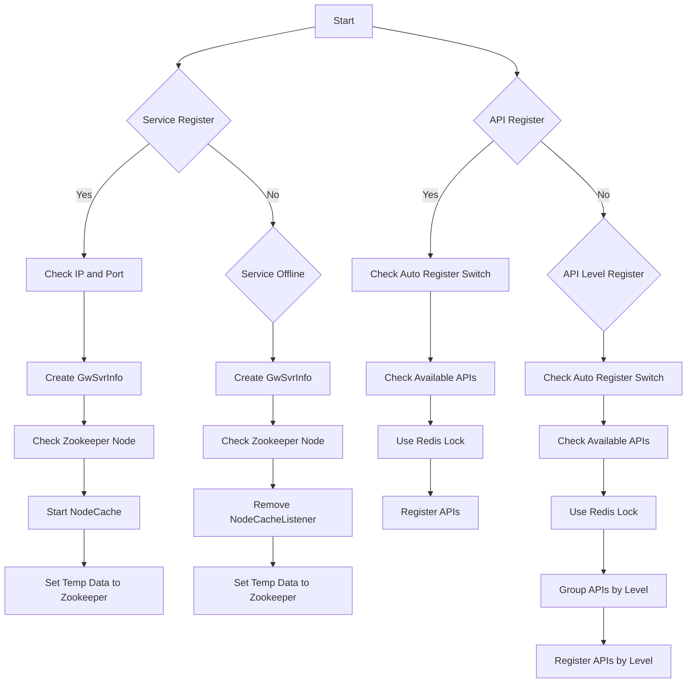

# 逐字稿
## 自我介绍
你好，我叫xxx，毕业于武汉纺织大学计算机科学与技术专业。在校期间，我连续两年获得一等奖学金，在蓝桥杯、数学建模、人工智能相关的比赛中也都获得过奖项。

毕业后，我加入了东方财富的国际证券部门，担任Java开发工程师，负责清算系统的前后端开发。技术栈主要涉及，SpringBoot、MyBatis、MySQL、Redis、Zookeeper 和 Vue。

在此期间，我参与了百万用户的数据迁移，协助制定了迁移方案，完善技术细节，并参与了迁移的实施。
通过分析JVM内存快照，我优化了 MySql jdbc 特定场景下的处理逻辑，将内存占用减少至原来的三分之一。
引入了 Testcontainers 进行集成测试，提高了开发效率。

在工作中的话，我可以保持高质量的工作标准，并乐于帮助同事解决问题。遇到问题时，同事们也愿意找我协助解决。

业余时间，我会学习一些工作之外的技术，并开发了一些小工具，像债券自动打新，和网页插件。

最近空闲的时候，我也在尝试利用AI完成复杂项目的开发，并总结出了一些有效的方法。

## hr 方面
### 空窗期
学车  旅游  减肥 手术 学习（看了一本书，一套技术教程） 学习用ai写代码 兼职

### 离职原因
晋升空间有限，业务边缘，技术上也到上限了。
公司有强制裁员指标 一笔订单亏了 40W usd

有丰富的SQL调优经验，及线上数据库死锁排查经验。

### 学习到了什么
- 团队合作 & 沟通
一个功能要两个模块共同配合完成。实现路径有很多。很可能 A模块多写了代码 B 模块就可以少写代码。B 模块多写代码 A 模块能少写代码。不同的实现方式以后的扩展能力也不同。这些东西就需要几个模块的负责人相互沟通、相互磨合。

### 问 HR
我面试表现的有什么地方不好？
您对我第一印象怎么样？
您觉得我有哪些地方可以改进？

您觉得我在简历中需要写明空窗期做了哪些事情吗？
我刚刚说空窗期做的那些事情，会打消一点您对我的一些顾虑吗？

## 项目
### 海外自研柜台清算系统
#### 项目描述
清算日间发生的交易，包括股票、债券、期货、期权等，保证资券正确交收。并对日间交易产生的数据进行归档。

#### 职责和贡献
- 把基于 Oracle 的项目进行重构，转换为使用 Java + MySQL，并协助完成百万用户数据迁移。
- 通过分析 JVM 内存快照，解决了从 Oracle 切换 MySql 后内存占用过高的问题。将内存占用量减少到原来的 1/3。
- 引入 `testcontainers` 进行集成测试，提高了测试效率，减少了对外部环境的依赖。同时让测试用例更便于管理，推动 `TDD` 的实践。
- 使用`责任链模式`重构清算系统的订单匹配逻辑，使得系统更加灵活，易于扩展。
- 使用`工厂模式` + 数据库配置的模式，实现了清算流程的动态配置，使得清算流程更加灵活。
- 根据实际业务特性，使用了吞吐量更高的 GC 。
- 完成项目的分布式改造，突破了单机内存的限制，使得清算系统能够处理更大的数据量。

#### 分布式改造
##### 背景
清算项目原本是单体的，所有的数据全部都从 mysql 读取，不使用缓存。数据迁移期间清算出现了单机内存不足的问题。于是开始了分布式改造

##### 改造项 1 任务分片方式
项目启动后会到 zk 中注册一个临时节点。

##### 改造项 2 缓存处理
码表 stockcode 在每台机器上都需要全量数据
以前是用 select * from stockcode where exchangetype = 'HK'。。。获取单市场全量数据。
改成分布式后，如果每台机器都全量数据，影响 mysql 性能，需要读取的数据量是 原始数据量 * 机器数量。

于是使用了 redis 缓存 stockcode 数据。

- 第一期，每次清算前，从 mysql 读取 stockcode 数据，写入 redis。为了防止 redis 内存占用过大，或者 真正的热点数据被挤出，影响其他业务，清算使用了单独的 redis 实例。

- 第二期，期权上线后，stockcode 数据量上升到百万级。每台机器保存全量码表数据，会占用大量内存。于是改成按需读取。

##### 待处理问题：
- 订单匹配任务不好拆分

#### 问题
异构难点值得讲的比如前后逻辑兼容性、数据涉及迁移的话怎么保证一致性、怎么切流

##### Q：怎么保证新系统（Java）的逻辑和原来的系统（Oracle）一致？

A：原来的系统对每天的清算结果都有归档，我们写了一个程序。通过模拟历史的清算数据，对比新系统和原系统的清算结果，保证了新系统的正确性。

对于读的操作，我们会把这个请求同时发给新系统和原系统，对比结果，并输出日志。

##### Q：批处理系统难以测试
- 对脏数据敏感
- 校验的表多
- 直接在开发线上测试，影响其他业务的测试（卡住了的话）。
- 没有先前积累的测试用例，编写用例麻烦。

采用 docker 启动一个新数据库的方式进行测试。解决了脏数据的问题。只用维护一个 sql 脚本。
直接将当时线上版本的跑出来的数据

##### Q：清算会修改资券，如果同时业务也操作了资券，会不会出现问题？

A：会有问题。解决方式：
1. 业务上，清算和业务操作资券的时间不重叠。
2. 技术上。使用乐观锁，保证数据的一致性。ABA 问题不敏感。

##### Q：清算系统的数据量很大，如何保证清算的性能？

A：多线程、CompletableFuture、索引优化、GC优化。

### 自研网关
#### 项目描述
使用 Netty 实现网关，同时支持 HTTP、TCP 协议，支持负载均衡、限流、熔断等功能。各业务系统启动后自动注册到网关，可以通过网关统一访问。

#### 职责和贡献
- 客服务启动时将接口注册到 zookeeper，网关通过 zookeeper 发现服务，实现了服务的自动发现。
- 客户端处理请求时，引入高低优先级队列对不同级别的请求进行处理，保证了高优先级请求的及时响应。TPS 提高了 50%。
- 记录各请求的处理时间，通过接口的平均处理时间，自动调整接口的优先级。
- 基于滑动窗口限流方式，提出了全新的限流模型。通过空间换时间的方式

#### 问题
Q：为什么不用 Nacos + Dubbo 等开源方案？

A：
1. 原先的老系统无法接入 Nacos 等新的开源方案。它只提供了 HTTP、TCP 的接口。老系统只有一个接口，通过入参的 functionId 来区分不同的业务。中台的逻辑也是基于此开发的，它们希望只用修改一个服务器 ip，就能兼容新旧系统切换。
2. Dubbo 虽然支持 HTTP 或者 自定义的协议，但中台代码还是需要改动。Dubbo http 调用，是用 post 请求 `http://ip:port/serviceClassName` { method: methodName, parameterTypes: [], arguments: [] } 这样的请求体，不符合老系统的接口规范。
3. 自研网关在业务上有更多的定制化需求。比如，数据迁移期间判断一个用户是否自研用户，不是自研的用户就返回错误码。
4. Dubbo 堆砌了很多功能，但我们实际上只需要其中的一部分功能。自研网关只实现了我们需要的功能，降低了复杂度。

Q：网关在安全方面有哪些措施呢？比如身份验证、授权等。

Q：如何保证网关的高可用？

A：

Q：负载均衡、限流、熔断、降级(服务治理)等功能如何实现？

A：熔断是

Q：自动调整优先级的具体策略是什么？

A：

Q：ZK 里面的节点是如何设计的？

Q：

### Sqlbridge 数据中间件
#### 项目描述
sqlbridge 是一个自研数据中间件，包括 support-sqlbridge 依赖和 Sqlbridge 服务两个部分。项目中引入 support-sqlbridge 后，可以将原本直接查询 MySQL 的 SQL 请求转发到 Sqlbridge 服务端，由 Sqlbridge 服务端执行查询后返回给客户端。在对外围提供了查询的功能同时，保证了柜台数据的安全，同时提供 sql 审计功能。

#### 职责和贡献
- 业务方服务启动时，解析各种方式配置的 SQL。
- 通过 AOP 拦截 SQL 请求，将 SQL 请求转发到 Sqlbridge 服务。
- 自定义实现了读写分离

1. explain 该语句的执行计划
2. 替换查询参数，拼接 排序条件
3. 分页请求是否要总数
4. 替换枚举值

#### 问题
Q：如何实现读写分离的？

A：自定义注解标识 sql 走读库还是写库，然后存入 threadlocal ，执行 sql 前切换数据源。

Q：thread local 相关八股。

Q：MyBatis 如何解析 SQL？

Q：MyBatis 缓存对 Sqlbridge 有什么影响？

Q：AOP 拦截 SQL 请求的具体实现？

A：自定义 @SQLBridge 注解，通过 @Around 拦截带有 @SQLBridge 注解的方法，将 SQL 请求转发到 Sqlbridge 服务端。

Q：Sql审计功能是怎么实现的？

A：sqlbridge 服务端接收到 sql 请求后，将 sql 语句和耗时记录到数据库中。 

// 定时查询 select * from sys.statements_with_full_table_scans; statments_with_sorting 等数据，将有问题的 sql 语句汇报给开发人员。

