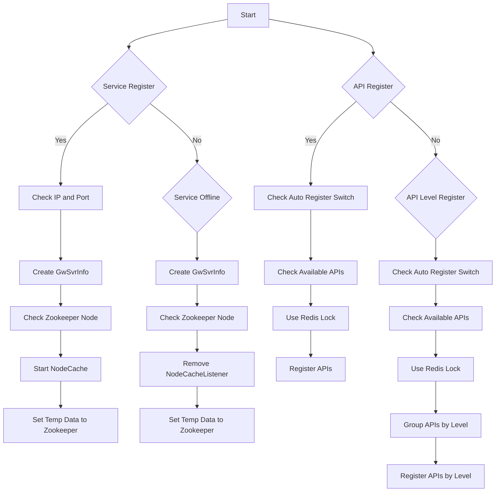

# 逐字稿
## 打招呼
我是一名Java开发工程师，具备3年金融行业服务端开发经验，为mysql jdbc 贡献过源码，曾就职于东方财富集团，参与多个核心系统的架构设计与开发工作。
主要是用的技术栈 java、springboot、mysql、mybatis、redis、zookeeper、netty、rpc。具有多线程、分布式、高并发、高负载、高可用性、系统调优等相关经验。
在职期间主导将旧有Oracle + C++系统重构为基于SpringBoot + MySQL的自研系统，确保百万级用户交易清算数据准确迁移。参与过交易链路优化、清结算、数据中间件等多个系统的开发和建设。
详细情况您可以看下我的简历，期待您的回复！

空窗期间经历有在简历中写明。我年前有面上一家公司，但是因为年后手术就没去。目前已经完全康复，可以接受高强度工作。期待有机会尽快加入新的团队，发挥我的技术优势。

## 自我介绍

您好！我叫黄成君，今年27岁。本科毕业于武汉纺织大学计算机专业，在校期间获得过几次奖学金，在一些比赛中也都获过奖。

21年毕业之后我加入了东方财富国际证券部门，担任服务端开发工程师，一直做到24年9月。
工作期间，我负责金融后台系统 的 核心代码编写。
我们项目组当时是要把 一套从外部采购的的基于 oracle + C++ 的柜台系统，重构为基于Java、mysql 这一套技术栈的自研系统。期间我参与了清结算、网关、交易、数据库中间件 等多个系统的开发与优化。 

在交易链路性能优化中，我把一个 20s 的计算逻辑，通过采用静态数据 + 增量流水汇总计算，结合游标查询、异步计算等技术，将实时性提升到毫秒级。
--通过锁 + 时间戳版本号的方式优化了高并发场景下的性能
单机吞吐量从 50 提升到2500，同时设计了熔断降级策略 保障核心交易链路稳定性。

清算平台项目里。我通过查看堆内存快照定位到了 DB 从 oracle 切换到 mysql 后内存膨胀的问题。
优化了 mysql jdbc 底层类型转换的逻辑，jvm 内存占用降低到原来的 30% 。
同时向 mysql jdbc 贡献了这段代码。

25年7月到今年2月，我加入了作业帮，主要负责聚合广告平台的开发。
这个平台的核心是接入多家广告渠道，竞价后返回给客户端，实现流量的变现。
它的峰值 QPS 达到 1w。技术栈主要是 Go、Redis、TiDB、RocketMQ。
广告系统中使用了本地缓存、Redis、MySQL 的三级缓存架构来保障请求性能。还实现了基于 Redis 滑动窗口的分布式频控系统。
另外在开发之余，我也在研究怎么用 AI 工具来提升开发效率，并且实际落地到了工作中。

工作之外我也会经常关注开源社区。我自己也曾经为 mysql jdbc 和 openclaw 贡献过源码。

## 自我介绍（HR 面）

您好，我叫黄成君，今年27岁，本科毕业于武汉纺织大学计算机专业，在校期间成绩排名前5%，多次获得奖学金。

毕业后我加入了东方财富国际证券部门，工作了三年多。期间我参与了公司核心系统从外购到自研的整体迁移，这个项目涉及百万级用户的数据迁移和多个业务系统的重构。在这个过程中，我不仅负责核心模块的开发，也积累了团队协作的经验——系统迁移需要和交易、清算、中台等多个团队紧密配合，确保业务连续性。这是我比较有成就感的一件事。

之后我加入了作业帮，负责广告平台的服务端开发，这个平台承载着公司的流量变现业务。在这段经历中我接触了不同的技术栈和业务场景，也拓宽了自己的视野。

回顾这几年的工作，我觉得自己有几个比较突出的特点：第一是学习能力比较强，无论是从 Java 转到 Go，还是从金融业务转到广告业务，我都能比较快地上手并产出成果；第二是做事比较扎实，在东方财富期间我发现了一个底层组件的性能问题，不仅在内部解决了，还向开源社区贡献了代码；第三是注重团队协作，我理解好的产出需要各方充分沟通，在实际工作中也一直是这么做的。

目前我希望找一个业务稳定、团队氛围好的平台，能够长期深耕，持续成长。以上就是我的自我介绍，谢谢。

## hr 方面
### 空窗期
学车  旅游  减肥 手术 学习（看了一本书，一套技术教程） 学习用ai写代码

### 离职原因
东方财富
晋升空间有限，业务边缘，技术上也到上限了。
一笔订单亏了 40W usd
公司有强制裁员指标，我主动要了个大礼包

作业帮
公司压力过大 996，人员流动频繁，去年入职7个人，只有两个人过了试用期。我最开始的 +1 +2 都被换掉了。感觉公司不太稳定了。想找一个更稳定的公司。
另外公司内部频繁调整业务线，我入职7个月给我调了2次业务线。
最后调整的这个业务线又要恢复 996。而且都是短平快的需求，app 流量很低，没有办法积累长期的业务壁垒了。

### 学习到了什么
- 团队合作 & 沟通
一个功能要两个模块共同配合完成。实现路径有很多。很可能 A模块多写了代码 B 模块就可以少写代码。B 模块多写代码 A 模块能少写代码。不同的实现方式以后的扩展能力也不同。这些东西就需要几个模块的负责人相互沟通、相互磨合。

### 问 HR
- 这个 HC 是新增还是替补？如果替补，前任离开原因是什么、在岗多久？
- 团队人数和人员稳定性怎样？
- 工作节奏：平时和高峰期每周加班频率？加班是调休、加班费还是默认“奉献”？

## 项目
### 海外自研柜台清算系统
#### 项目描述
清算日间发生的交易，包括股票、债券、期货、期权等，保证资券正确交收。并对日间交易产生的数据进行归档。

#### 职责和贡献
- 把基于 Oracle 的项目进行重构，转换为使用 Java + MySQL，并协助完成百万用户数据迁移。
- 通过分析 JVM 内存快照，解决了从 Oracle 切换 MySql 后内存占用过高的问题。将内存占用量减少到原来的 1/3。
- 引入 `testcontainers` 进行集成测试，提高了测试效率，减少了对外部环境的依赖。同时让测试用例更便于管理，推动 `TDD` 的实践。
- 使用`责任链模式`重构清算系统的订单匹配逻辑，使得系统更加灵活，易于扩展。
- 使用`工厂模式` + 数据库配置的模式，实现了清算流程的动态配置，使得清算流程更加灵活。
- 根据实际业务特性，使用了吞吐量更高的 GC 。
- 完成项目的分布式改造，突破了单机内存的限制，使得清算系统能够处理更大的数据量。

#### 分布式改造
##### 背景
清算项目原本是单体的，所有的数据全部都从 mysql 读取，不使用缓存。数据迁移期间清算出现了单机内存不足的问题。于是开始了分布式改造

##### 改造项 1 任务分片方式
项目启动后会到 zk 中注册一个临时节点。

##### 改造项 2 缓存处理
码表 stockcode 在每台机器上都需要全量数据
以前是用 select * from stockcode where exchangetype = 'HK'。。。获取单市场全量数据。
改成分布式后，如果每台机器都全量数据，影响 mysql 性能，需要读取的数据量是 原始数据量 * 机器数量。

于是使用了 redis 缓存 stockcode 数据。

- 第一期，每次清算前，从 mysql 读取 stockcode 数据，写入 redis。为了防止 redis 内存占用过大，或者 真正的热点数据被挤出，影响其他业务，清算使用了单独的 redis 实例。

- 第二期，期权上线后，stockcode 数据量上升到百万级。每台机器保存全量码表数据，会占用大量内存。于是改成按需读取。

##### 待处理问题：
- 订单匹配任务不好拆分

#### 问题
异构难点值得讲的比如前后逻辑兼容性、数据涉及迁移的话怎么保证一致性、怎么切流

##### Q：在做这个系统或者说项目的时候，有没有哪一个具体的对你来说比较复杂具体的功能点。
怎么去确保新老系统业务逻辑的一致性
S：我们当时去开发系统的时候，是通过操作终端然后观察数据库数据变化来猜测业务逻辑。当时自研系统基本功能刚开发完成不久，很多业务的边界情况老系统是怎么处理的我们不太清楚。
T：所以我当时决定采用 TDD 的思路构建一个校验程序，。
A：具体的分为几个步骤。第一步就是构建一个校验的数据集，这是通过旧系统归档的数据加上各个表的修改流水构建的，这套数据里里面包含的日期是我们特地选择的几个特殊日期。第二步，用自研的清算系统进行清算。第三步，对比校验。第四步就是人工分析校验失败的数据。找到错误的原因，并进行修复，这个原因可能有两个方面，一个是用来校验的数据有问题，一个是清算的逻辑有问题。我们就需要去修改对应的构建数据集的代码，或者是清算的代码。
R：通过这套机制我们确保了新老系统绝大部分代码的一致性。线上用户迁移后 0 故障。

切换数据库后内存膨胀问题
S：进行数据的比对的时候，我发现 同样的数据量，从 oracle 读入不会 oom 但是从 mysql 读入会。
T：我需要找出这其中的原因。
A：

##### Q：怎么保证新系统（Java）的逻辑和原来的系统（Oracle）一致？

A：原来的系统对每天的清算结果都有归档，我们写了一个程序。通过模拟历史的清算数据，对比新系统和原系统的清算结果，保证了新系统的正确性。

对于读的操作，我们会把这个请求同时发给新系统和原系统，对比结果，并输出日志。

##### Q：批处理系统难以测试
- 对脏数据敏感
- 校验的表多
- 直接在开发线上测试，影响其他业务的测试（卡住了的话）。
- 没有先前积累的测试用例，编写用例麻烦。

采用 docker 启动一个新数据库的方式进行测试。解决了脏数据的问题。只用维护一个 sql 脚本。
直接将当时线上版本的跑出来的数据

##### Q：清算会修改资券，如果同时业务也操作了资券，会不会出现问题？

A：会有问题。解决方式：
1. 业务上，清算和业务操作资券的时间不重叠。
2. 技术上。使用乐观锁，保证数据的一致性。ABA 问题不敏感。

##### Q：清算系统的数据量很大，如何保证清算的性能？

A：多线程、CompletableFuture、索引优化、GC优化。

### 自研网关
#### 项目描述
使用 Netty 实现网关，同时支持 HTTP、TCP 协议，支持负载均衡、限流、熔断等功能。各业务系统启动后自动注册到网关，可以通过网关统一访问。

```mermaid
graph TD
    A[Start] --> B{Service Register}
    B -->|Yes| C[Check IP and Port]
    C --> D[Create GwSvrInfo]
    D --> E[Check Zookeeper Node]
    E --> F[Start NodeCache]
    F --> G[Set Temp Data to Zookeeper]
    B -->|No| H{Service Offline}
    H --> I[Create GwSvrInfo]
    I --> J[Check Zookeeper Node]
    J --> K[Remove NodeCacheListener]
    K --> L[Set Temp Data to Zookeeper]
    A --> M{API Register}
    M -->|Yes| N[Check Auto Register Switch]
    N --> O[Check Available APIs]
    O --> P[Use Redis Lock]
    P --> Q[Register APIs]
    M -->|No| R{API Level Register}
    R --> S[Check Auto Register Switch]
    S --> T[Check Available APIs]
    T --> U[Use Redis Lock]
    U --> V[Group APIs by Level]
    V --> W[Register APIs by Level]
```

#### 职责和贡献
- 客服务启动时将接口注册到 zookeeper，网关通过 zookeeper 发现服务，实现了服务的自动发现。
- 客户端处理请求时，引入高低优先级队列对不同级别的请求进行处理，保证了高优先级请求的及时响应。TPS 提高了 50%。
- 记录各请求的处理时间，通过接口的平均处理时间，自动调整接口的优先级。
- 基于滑动窗口限流方式，提出了全新的限流模型。通过空间换时间的方式

#### 问题
Q：为什么不用 Nacos + Dubbo 等开源方案？

A：
1. 原先的老系统无法接入 Nacos 等新的开源方案。它只提供了 HTTP、TCP 的接口。老系统只有一个接口，通过入参的 functionId 来区分不同的业务。中台的逻辑也是基于此开发的，它们希望只用修改一个服务器 ip，就能兼容新旧系统切换。
2. Dubbo 虽然支持 HTTP 或者 自定义的协议，但中台代码还是需要改动。Dubbo http 调用，是用 post 请求 `http://ip:port/serviceClassName` { method: methodName, parameterTypes: [], arguments: [] } 这样的请求体，不符合老系统的接口规范。
3. 自研网关在业务上有更多的定制化需求。比如，数据迁移期间判断一个用户是否自研用户，不是自研的用户就返回错误码。
4. Dubbo 堆砌了很多功能，但我们实际上只需要其中的一部分功能。自研网关只实现了我们需要的功能，降低了复杂度。

Q：网关在安全方面有哪些措施呢？比如身份验证、授权等。

Q：如何保证网关的高可用？

A：

Q：负载均衡、限流、熔断、降级(服务治理)等功能如何实现？

A：熔断是

Q：自动调整优先级的具体策略是什么？

A：

Q：ZK 里面的节点是如何设计的？

Q：

### Sqlbridge 数据中间件
#### 项目描述
sqlbridge 是一个自研数据中间件，包括 support-sqlbridge 依赖和 Sqlbridge 服务两个部分。项目中引入 support-sqlbridge 后，可以将原本直接查询 MySQL 的 SQL 请求转发到 Sqlbridge 服务端，由 Sqlbridge 服务端执行查询后返回给客户端。在对外围提供了查询的功能同时，保证了柜台数据的安全，同时提供 sql 审计功能。

#### 职责和贡献
- 业务方服务启动时，解析各种方式配置的 SQL。
- 通过 AOP 拦截 SQL 请求，将 SQL 请求转发到 Sqlbridge 服务。
- 自定义实现了读写分离

1. explain 该语句的执行计划
2. 替换查询参数，拼接 排序条件
3. 分页请求是否要总数
4. 替换枚举值

#### 问题
Q：如何实现读写分离的？

A：自定义注解标识 sql 走读库还是写库，然后存入 threadlocal ，执行 sql 前切换数据源。

Q：thread local 相关八股。

Q：MyBatis 如何解析 SQL？

Q：MyBatis 缓存对 Sqlbridge 有什么影响？

Q：AOP 拦截 SQL 请求的具体实现？

A：自定义 @SQLBridge 注解，通过 @Around 拦截带有 @SQLBridge 注解的方法，将 SQL 请求转发到 Sqlbridge 服务端。

Q：Sql审计功能是怎么实现的？

A：sqlbridge 服务端接收到 sql 请求后，将 sql 语句和耗时记录到数据库中。 

// 定时查询 select * from sys.statements_with_full_table_scans; statments_with_sorting 等数据，将有问题的 sql 语句汇报给开发人员。

