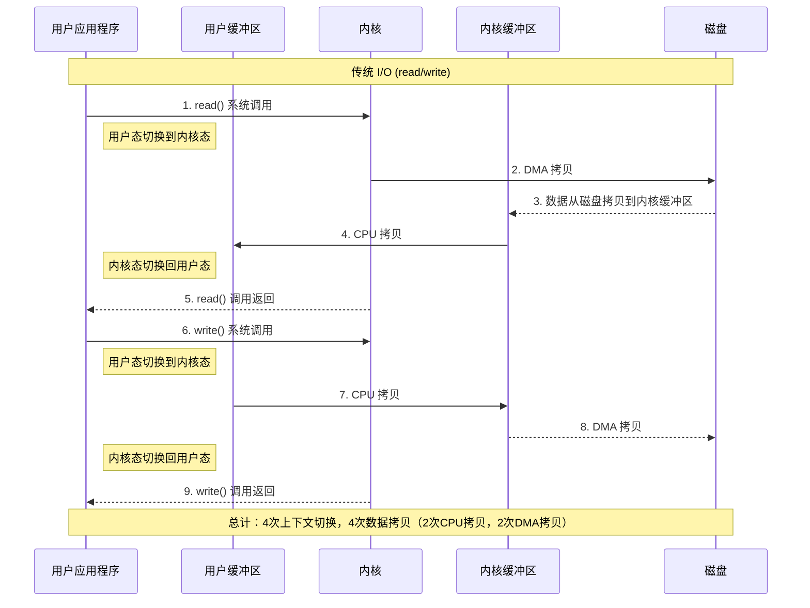
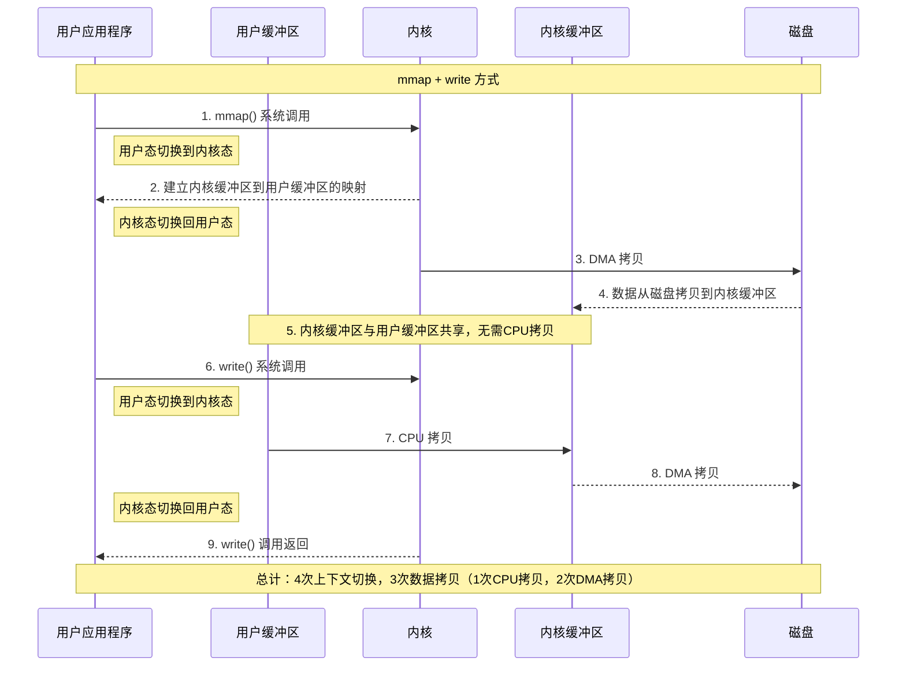
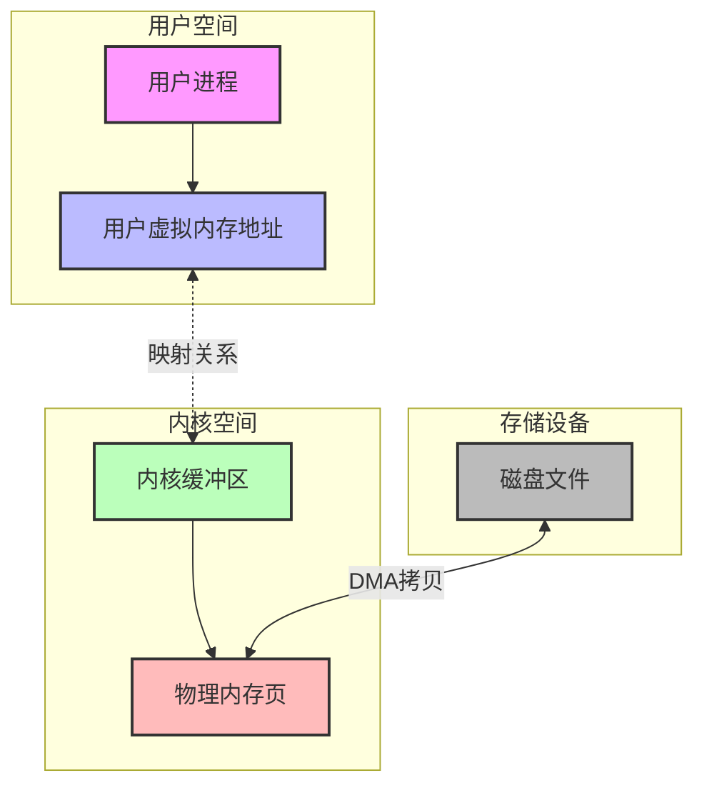
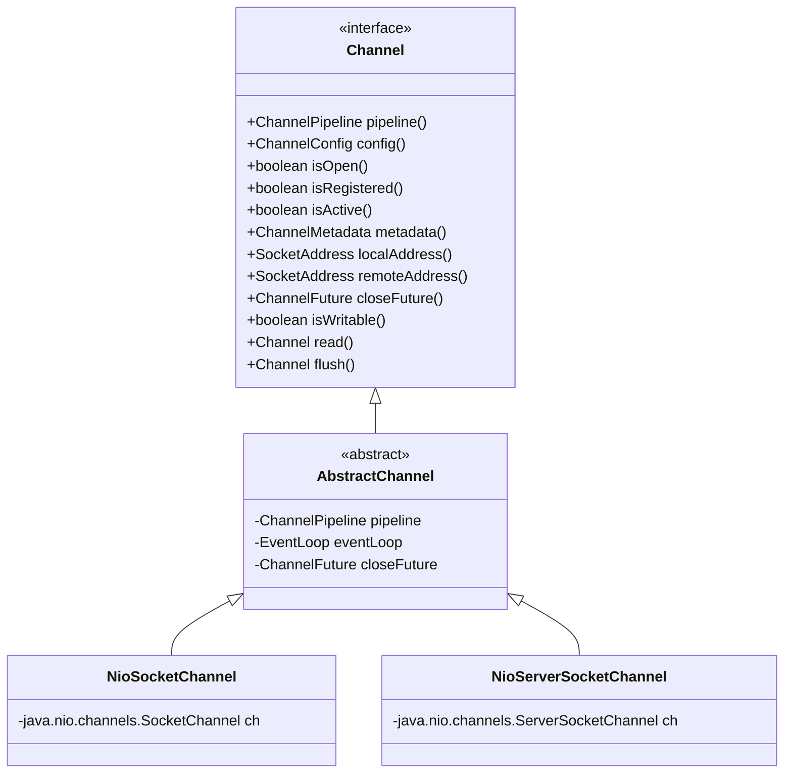
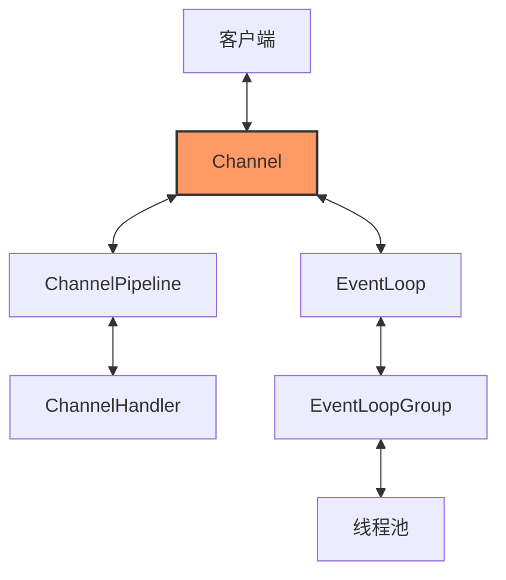

# mmap 内存映射原理

## 传统 I/O 操作流程

## mmap 内存映射原理

## mmap 工作原理图

## mmap 的优势

1. **减少数据拷贝次数**：通过内存映射，减少了内核缓冲区到用户缓冲区的一次 CPU 拷贝

2. **减少内存使用**：直接映射文件到用户空间，避免了额外的缓冲区开销

3. **提高 I/O 性能**：特别是对大文件的读写操作，性能提升明显

4. **支持共享内存**：多个进程可以通过 mmap 共享同一块物理内存

## mmap 的应用场景

1. 大文件处理
2. 进程间通信
3. 数据库系统
4. 高性能 I/O 框架（如 Netty、Kafka 等） 

## Channel

